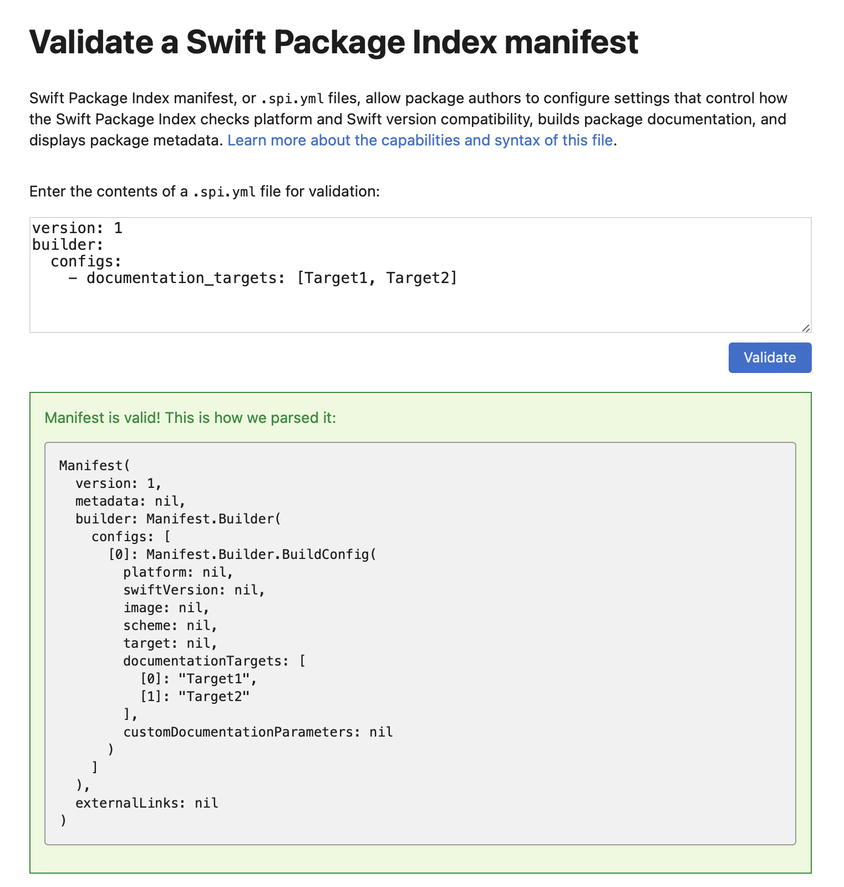

# Manifest Validation

How to validate `.spi.yml` files.

## Overview

The easiest way to validate a `.spi.yml` is via the [Online Validator](https://swiftpackageindex.com/validate-spi-manifest) on the [Swift Package Index website](https://swiftpackageindex.com).

### Online Validator

The [Online Validator](https://swiftpackageindex.com/validate-spi-manifest) is a simple web form where you can submit your sample `.spi.yml` file and it will run the exact same parser as during package processing.

The validator will display the parsed result or error messages if it fails.

